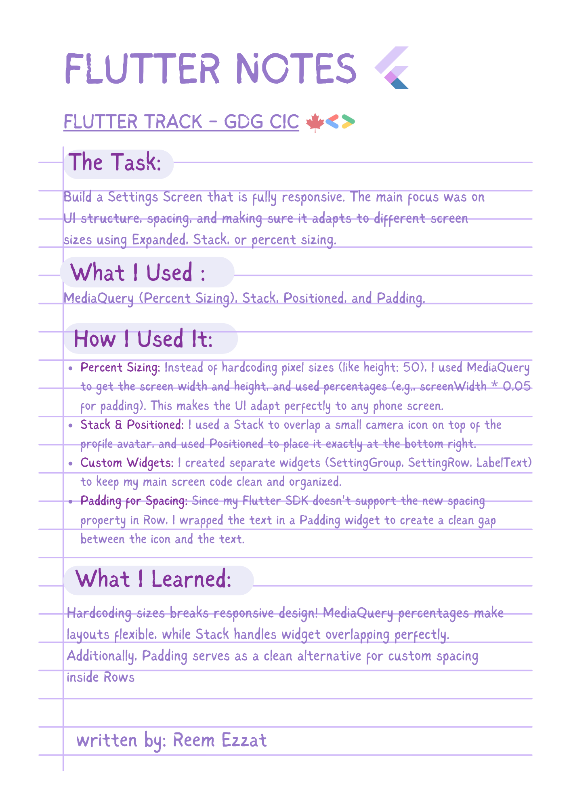
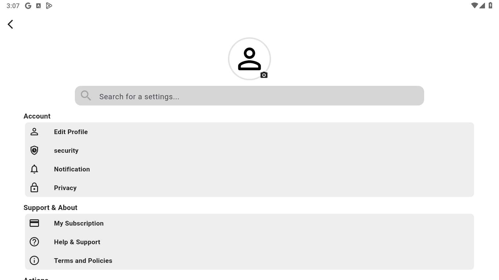

# Responsive-Settings-Screen⚙️




## 💻 Example Code

```dart
// 1. Using MediaQuery for responsive padding (Percent Sizing)
Padding(
  padding: EdgeInsets.only(
    top: screenHeight * 0.005,
    right: screenWidth * 0.05,
    left: screenWidth * 0.05,
  ),
  child: Container(/* ... */,
  ),
)

// 2. Using Padding for Row spacing instead of SizedBox or Row.spacing
Row(
  children: [
    icon,
    Padding(
      padding: const EdgeInsets.only(left: 8.0), // Creates the gap
      child: Text(text, style: TextStyle(fontWeight: FontWeight.bold)),
    ),
  ],
)
````
💡 **Tip:** Always wrap your main screen content in a **`SingleChildScrollView`**! Even if your UI looks perfect on your phone, smaller phones might cut off the bottom of the screen. **`SingleChildScrollView`** ensures users can scroll down to see everything safely.

## 🎬 DEMO
**Mobile Screen:**

**Tablet Screen:**

